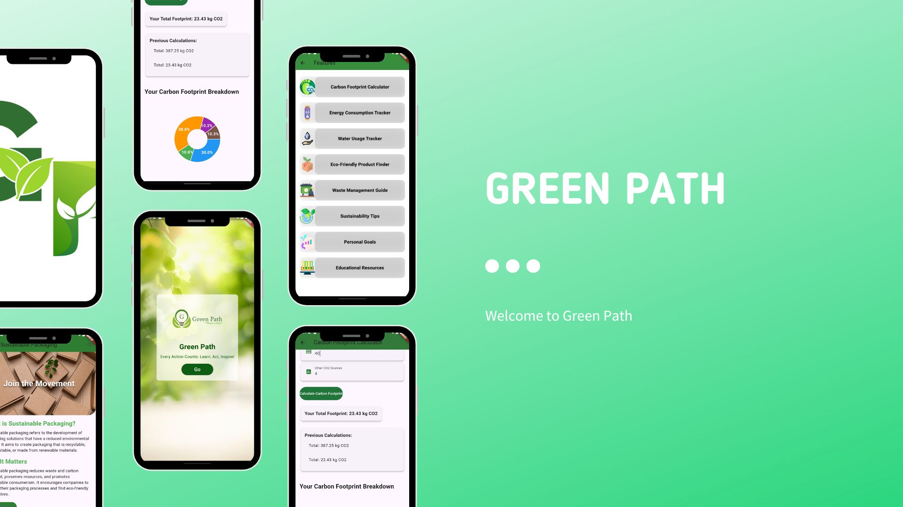

# Green Path 🌱

[](LICENSE)

Green Path is an innovative mobile application designed to empower users to make sustainable choices and track their environmental impact. 



## Features

- **Carbon Footprint Calculator**: Calculate and reduce your carbon emissions.
- **Energy Consumption Tracker**: Monitor and manage your energy usage.
- **Water Usage Tracker**: Track your water consumption and promote conservation.
- **Eco-Friendly Product Finder**: Discover sustainable products for everyday use.
- **Waste Management Guide**: Learn best practices for waste disposal.
- **Sustainability Tips**: Access practical tips for living sustainably.
- **Personal Goals**: Set and track your own environmental goals.
- **Educational Resources**: Explore articles and materials on sustainability.

## Installation

Follow these steps to set up Green Path locally:

1. **Clone the repository**:
   ```bash
   git clone https://github.com/AstroTech-666/green-path-app.git
2. Navigate to the project directory:
      ```bash
   cd green-path-app
   
3. Install dependencies:
      ```bash
   flutter pub get

4. Run the app:
      ```bash
   flutter run

Contact
For questions or feedback, feel free to reach out:

Email: abdulzadafarzana38@gmail.com

- Green Path Overview: Visit [Green Path](https://hundred.org/en/innovations/green-path) for more information about the app's features and impact on promoting sustainable choices.
